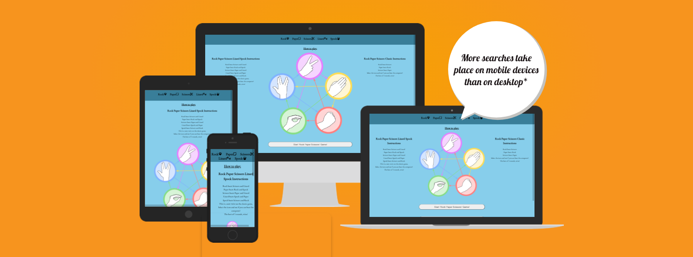
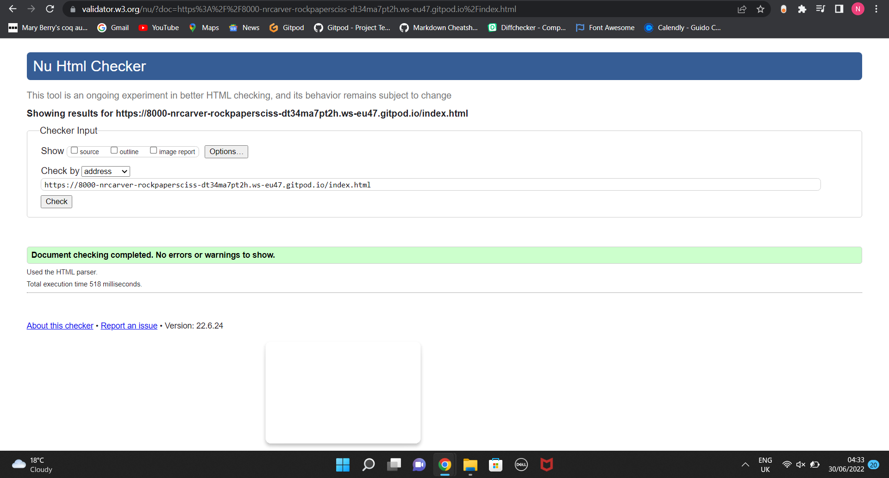
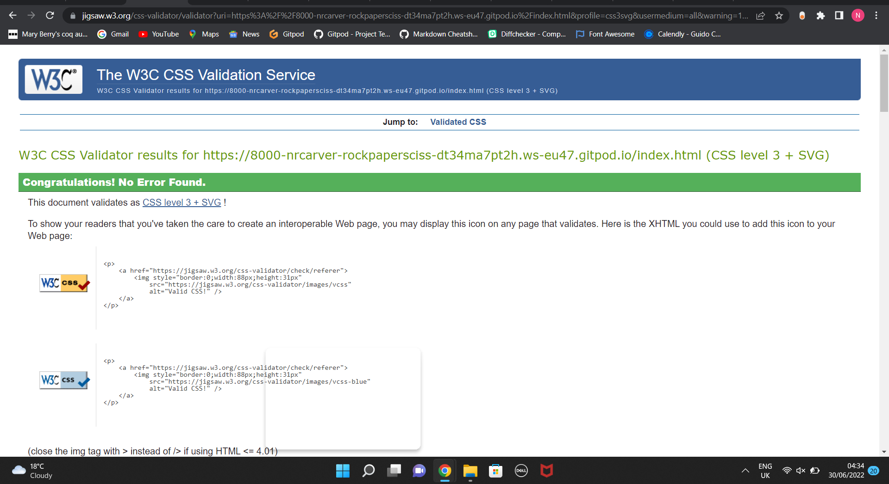
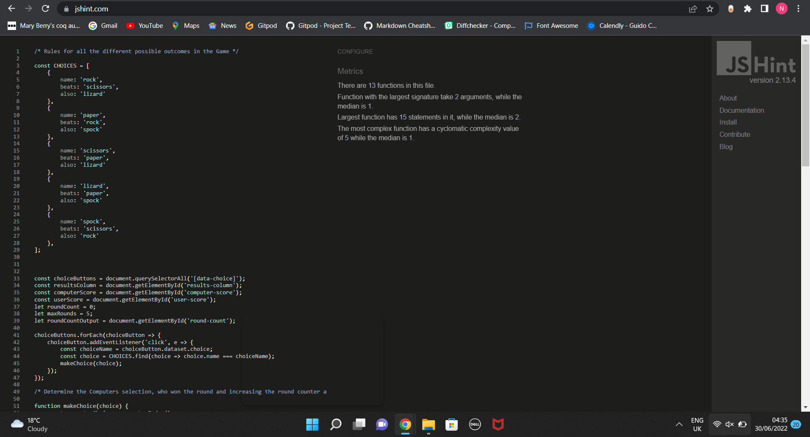
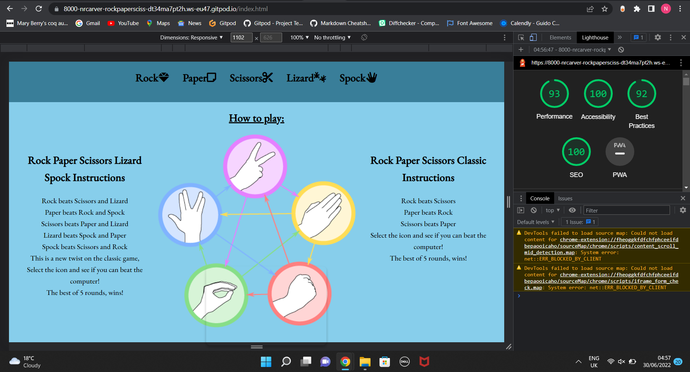
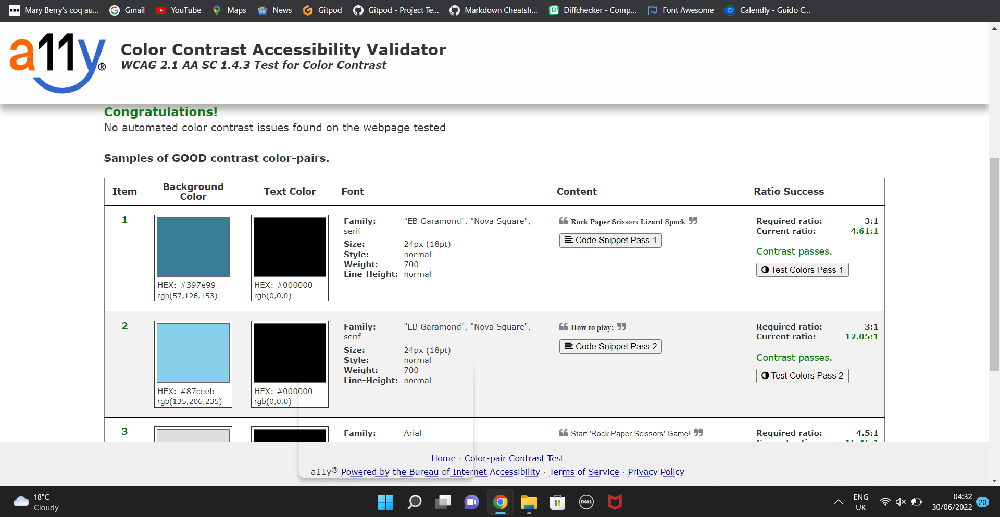
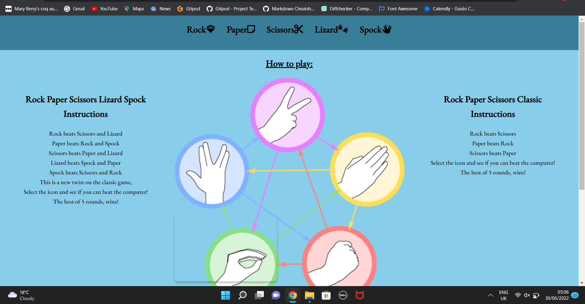
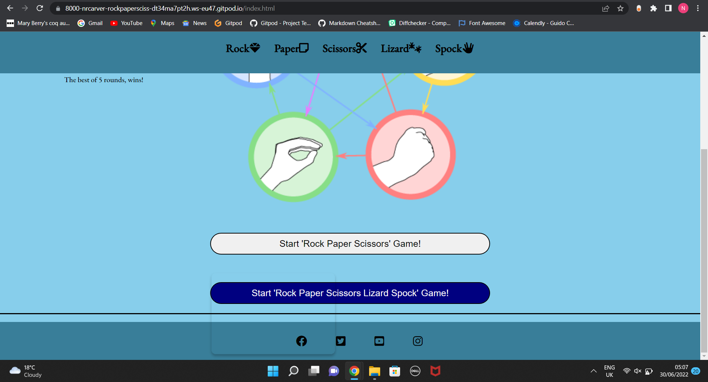
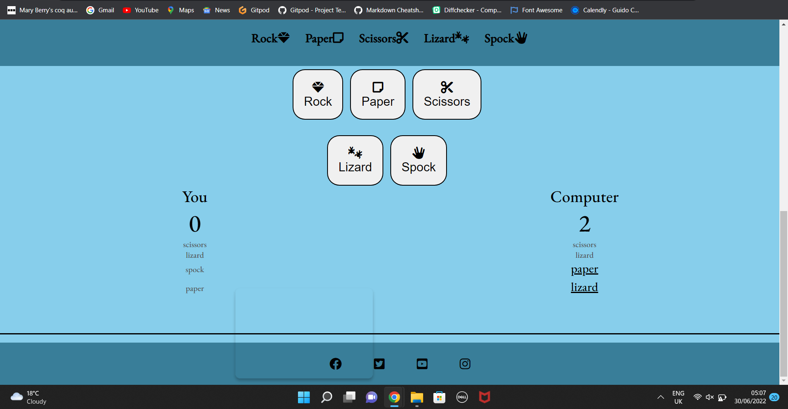
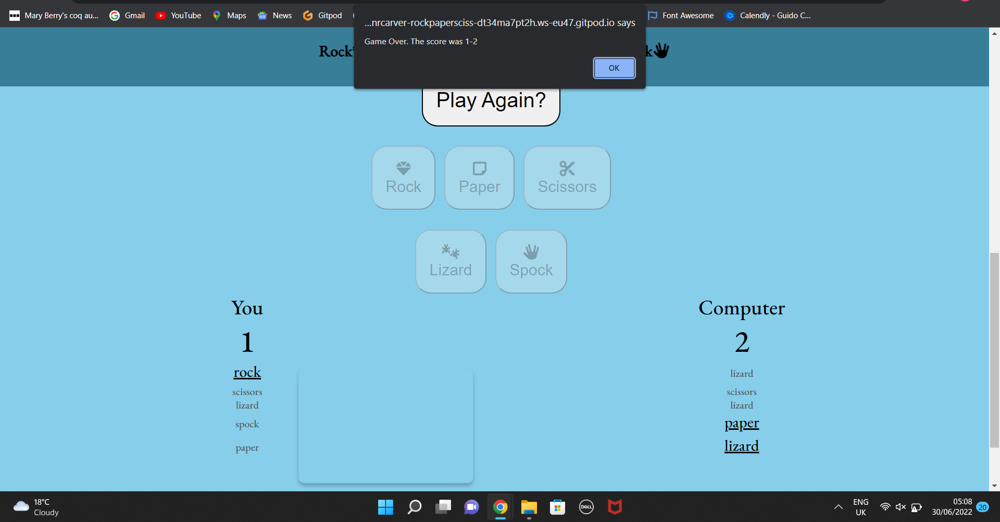

# Rock Paper Scissor Lizard Spock

[View the website here](LINK TO THE WEBSITE!)

This website has been created as a fun game for people to play and to introduce people to 'Rock, Paper, Scissors, Lizard, Spock' (RPSLS), a newer version of the traditional game, 'Rock, Paper, Scissors'.

The website features two main sections:

1. Showing you the rules of both 'Rock, Paper, Scissors' and 'RPSLS' and a helpful graphic.

2. The Game Area where you can choose to play either game, with the full game history shown and scores calculated. 

## Goals of the Website

Business Goals:

- To create a website that is easy for users of all ages to use.

- To provide a fun and interactive way to play 'Rock, Paper, Scissors' against the computer

- To educate people about 'RPSLS' and spread awareness in a fun way.

User Goals

- To play 'Rock, Paper, Scissors' against the computer.

- To learn about 'RPSLS' and how to play.

- To play 'RPSLS' against the computer.

- To easily see what moves were played and won in each game.

# UX

## Strategy

As it is the first pillar of UX, I started my project thinking about my target audience, and what they would be looking for in a website.   

I decided my Target Audience were:

- Children from 6+.
- Children who enjoy playing games on the computer.
- Children who are looking for a new game they can quickly pick up.

I decided my key features were:

- An explaination of the rules of 'RPSLS'
- Being able to play both 'Rock, Paper, Scissors' and 'RPSLS'.
- Score tracking over multiple rounds.
- Display previous rounds and easily differentiate between winners and losers.

Overall the most important think for me was clear instructions and simple game mechanics so the website can be used by all ages.

## Scope

To achieve these goals I decided that my website needed the following features:

- Clear information explaining the rules of both games.
- A graphic showing the different game combinations visually.
- Start Buttons for each game that are clearly labeled.
- A table showing the current and previous results.
- An alert when you finish the game with a final score.
- A new game button so you can start again after each game.

## Structure

To keep the website easily digestible, I kept all the information on a single page. I did consider making the website multi-pages with landing pages for the end of games but this seemed like adding complexity for the sake of it without providing any extra value to the user. I also the website to be accesible on smaller screens, so added media queries putting the information and graphics in a single column, keeping it clear and easy to digest.

## Skeleton

To keep the website sleek I want the layout short and the website will only have 3 key areas.
1. Header
2. Description of the two areas with a graphic.
3. Game area, this needs to be a single screen without the user scrolling the click other buttons.

## Surface

For my colour scheme, I chose a Sky Blue background and Black text. It is a soft blue that doesnt distract away from the game and provides good contrast from accesibility purposes. For my font, I selected 'Garamond' as its simple style fit my website well and it looks good as both a header and in paragraph text.

# Features

- Header

Defined header that stays at the top of the page with the title of the page, including icons to make the text more appealing. It is the same colour scheme as the footer giving symmetry to the page.

- How to Play Information
A clear section that easily defines the rules to both 'Rock, Paper, Scissors' and 'RPSLS'. This includes a graphic, showing you visually how the game works. Each header is in an <h2> element with page breaks   after each line to aid readability. The overall title is also underlined, denoting it as such.

- Game Selection

Two Buttons are present, clearly marked for which game you would like to play. They are equally spaced and large so a child could use them. When you hover over each button, the colour scheme inverts to a navy button with white text so you can easily see which option you are hovering over.

- Game Buttons 
Similar to the Game Selection buttons, they are slightly oversized and spaces between them so a child could use them and they also invert colours when you hover over them. Each button also has the icon representing the selection so you can easily see which selection is which.

- Scoring Section
The scoring section shows you the result of the most recent choice as well as the previous games. Your most recent game appears at the top of the list for user ease. The selection that wins is made larger and underlined while the loser is slightly greyed out so that it is very obvious which choice won. The scoring counter also tracks the score and rounds played automatically for you. 

- Final Result Alert

After 5 rounds and the game is over, an alert pops up telling you the final score between you and the computer. This help signify the end of game and tells you exactly what you scored.

- Play Again

After a game is completed, all of the other buttons are disabledand greyed out. The user can either choose to stay on the page and look at the last game score or they can choose to play again and the game will start again, taking them back to their first choice of what game to play.

# Technologies Used

- HTML - Used as a building block of the page and structuring and displaying all of the content.

- CSS - Used to style all of the content in HTML and any created in JavaScript.

- Javascript - Used to create a functional and responsive game that can make its own selections, determine winners and losers and display this content back into HTML.

- Google Fonts  - Used for the font used across the website.

- FontAwesome - Used for the Icons in the header and the different selections.

- Google Developer Tool - Used to check my work periodically, debug my code when needed and also test the responsiveness of my website.

- GitHub - Used to store my project.

- Git - Used for version control on my project.

- GitPod - Used as a development envirnnment.

- Unicorn Revealer - Used to help visualise my HTML and fix any issues.

- W3C Markup Validation Service - Used to validate all of my HTML code.

- W3C CSS Validation Service - Used to validate all of my CSS code.

- Color Contrast Accessibility Validator - Used to check my website colours had enough contrast for accessibility purposes.

- Dirty Markup Formatter - Used to standardise and format my HTML and CSS code.

- AmIResponsive - Used to generate a responsive image for my README file.

# Testing

As mentioned above, I have tested all my of HTML, CSS and Javascript through validators. None of them passed initialy but after some tidying up and correcting some missing semi-colons, my code has passed through all of them.

I also checked the accessibility of my website using Lighthouse on Google Developer Tools and The Color Contrast Accesibility Validator and the website passed both of those first time.

I also tested my code and its functionality various times as well as asking friends and familiy to have a look at the website. 

While testing I kept in mind 3 of my key User Stories.

1. A new user learning about 'RPSLS' for the first time and playing the game.
2. A new user who wants to play classic 'Rock, Paper, Scissors'
3. A returning user who to play either or both versions of the game.

My website meets criteria for all 3 of these users. The layout is clear and the information obvious and broken down into small chunks. For returning users, the single webpage means they can quickly navigate to the game and jump straight in.

## Bugs and Further Development

I ran into quite a few bugs while coding this project but luckily most of them were quite simple to solve. There were 2 large bugs that I was not able to solve:

1. I wanted to add functionality for the player to be able to choose the length of the game but unfortunately was unable to do so yet.

2. For the play again function, I was able to start a new game but whenever I started the new game, the results from the previous game would still be displayed. I did find a workaround for this though as the play again function now reloads the page, bringing the user back to the start and reseting any values for their new game. It is not an ideal solution but it works currently and I would look to improve it in the near future.

# Deployment

The website is hosted in GitHub pages and deployed directly from the master branch. Any new commits made will be automatically deployed to the website.

Gitpod was used to develop the project with my code then commited to Git and then pushed through to Github. In Github I deployed by changing the 'Source' from 'None' to 'Main'. This option can be found at: "" > Settings > Pages > Source.

After changing the setting you must wait a few minutes and then the deployed website can be accessed.

# Credit

The graphic to illustrate 'RPSLS' is from https://www.seekpng.com/ipng/u2w7w7o0i1t4o0a9_rock-paper-scissors-lizard-spock-rock-paper-scissors/.

All Icons used are from FontAwesome.

The following websites frequently helped when I was stuck with some code:

- stackoverflow.com
- w3schools.com/
- WebDevSimplified on Youtube (https://www.youtube.com/c/WebDevSimplified)

I would also like to thanks Guido Cecillio for his guidance and support throughout this project and my course.
